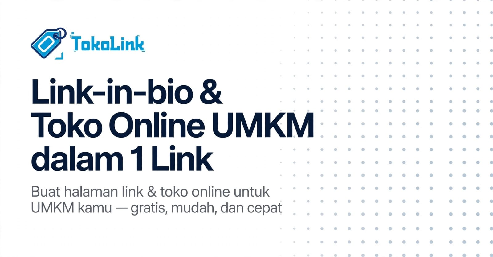

<div align="center">
  
  <p><strong>Satu link untuk semua toko.</strong> Link-in-bio + katalog + checkout QRIS untuk UMKM Indonesia.</p>
  <p>
    <a href="https://www.tokolink.store"></a>
    
    
    
  </p>
</div>

---

## Tentang

TokoLink memberi setiap penjual UMKM **satu halaman publik** (link-in-bio + katalog produk + checkout QRIS) yang bisa dibagikan lewat WhatsApp/Instagram — tanpa perlu bikin website sendiri. Pembeli tidak perlu daftar akun, cukup buka link, pilih barang, scan QRIS, selesai.

🌐 **Live:** [www.tokolink.store](https://www.tokolink.store)



## Fitur

- 🏬 **Halaman toko publik** — profil, katalog, pencarian, badge buka/tutup otomatis (zona WIB)
- 🎨 **8 tema storefront** — seller pilih → pratinjau → terapkan; satu data, delapan wajah (`docs/THEME_ENGINE.md`)
- 🧾 **Checkout QRIS (BuatQris)** — total dihitung ulang di server, webhook HMAC, status real-time
- 🔗 **Tautan bio** — ikon otomatis dari URL (WhatsApp, Instagram, TikTok, YouTube, Telegram, Shopee, Tokopedia)
- 📦 **Dashboard seller** — produk, pesanan, promo, jam buka, QR toko, dompet & penarikan dana
- 🛡️ **Admin platform** — kelola seller, premium, penarikan, seluruh transaksi
- 🔒 **Keamanan** — RLS di semua tabel, secret hanya di server, tanpa `innerHTML` untuk data pengguna

## Teknologi

| Lapisan | Stack |
|---|---|
| Frontend | React 19 + Vite + TypeScript + Tailwind CSS 4 (router custom, tanpa react-router) |
| Backend | Supabase (Postgres + Auth + Storage + Realtime) |
| Pembayaran | BuatQris (QRIS) |
| Deploy | Vercel (`tokolink.store`) |

## Mulai (lokal)

```bash
npm install
cp .env.example .env   # isi VITE_SUPABASE_URL & VITE_SUPABASE_ANON_KEY
npm run dev
```

Lalu di **Supabase SQL Editor**, jalankan berurutan:

1. `database/schema.sql` — tabel utama + RLS dasar
2. `database/migrate_fase5_theme.sql` — tabel `store_theme`
3. `database/migrate_fase5_theme_id.sql` — kolom pilihan tema
4. Migrasi lain sesuai fitur: `migrate_profiles_media.sql`, `migrate_storage.sql`, `migrate_fase3*.sql`, `migrate_bio_link_clicks.sql`, `migrate_discount_created_at.sql`, `migrate_traffic.sql`

> Secret (`SUPABASE_SERVICE_ROLE_KEY`, kredensial BuatQris) hanya untuk server functions — **jangan** taruh di `.env` dengan prefix `VITE_*`.

## Struktur

```
├── src/
│   ├── pages/          # Landing, Auth, Storefront (buyer), DashboardA/B (seller), Admin, System
│   ├── storefront/     # Theme Engine: types, registry, 8 tema (hanya presentasi)
│   ├── components/     # UI reusable (Logo, ui, layout, charts)
│   └── lib/            # router, supabase client, auth, links, format, data contoh lama
├── api/                # Vercel serverless functions (create-order, webhook, …)
├── database/           # schema.sql + migrasi bernomor per fase
└── docs/               # PRD.md (apa), ARCHITECTURE.md (bagaimana), THEME_ENGINE.md
```

Detail arsitektur (diagram sistem, ER, alur checkout): [`docs/ARCHITECTURE.md`](docs/ARCHITECTURE.md).

## Lisensi

Proprietary — Hak Cipta © 2026 Muhammad Farid. Seluruh hak dilindungi. Lihat [`LICENSE`](LICENSE). Dilarang menyalin, memodifikasi, atau mendistribusikan ulang tanpa izin tertulis.

---

<div align="center">Dibuat oleh <strong>Muhammad Farid</strong> · <a href="https://www.tokolink.store">tokolink.store</a></div>
