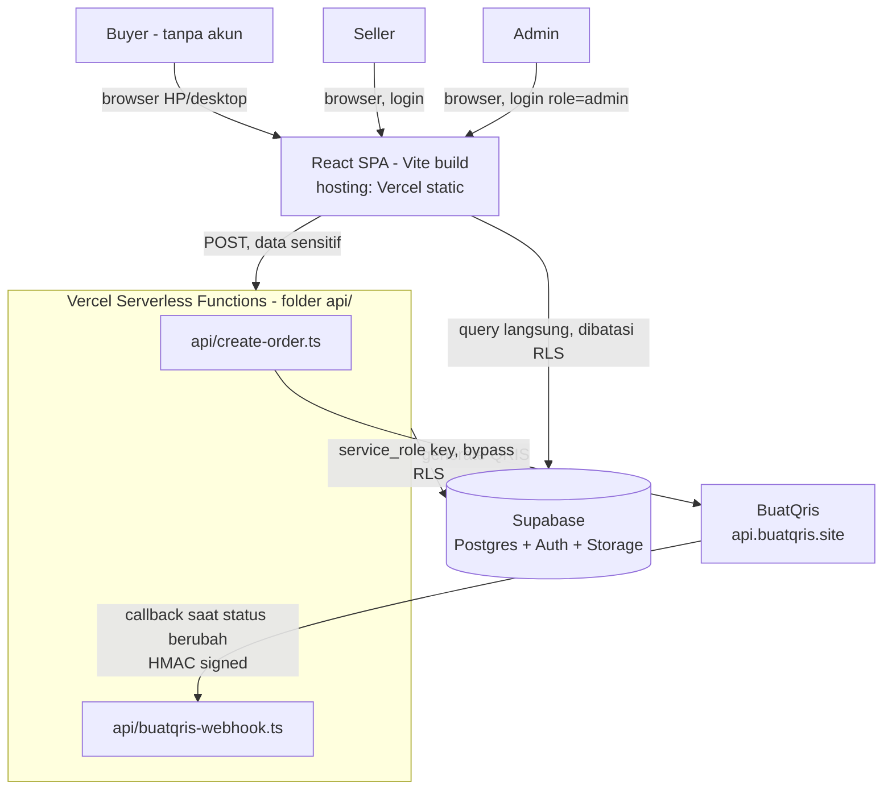
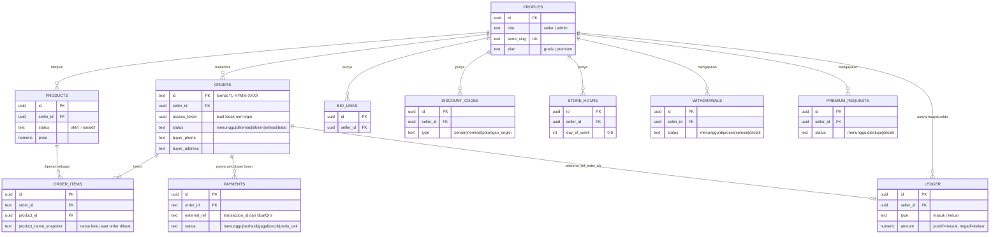
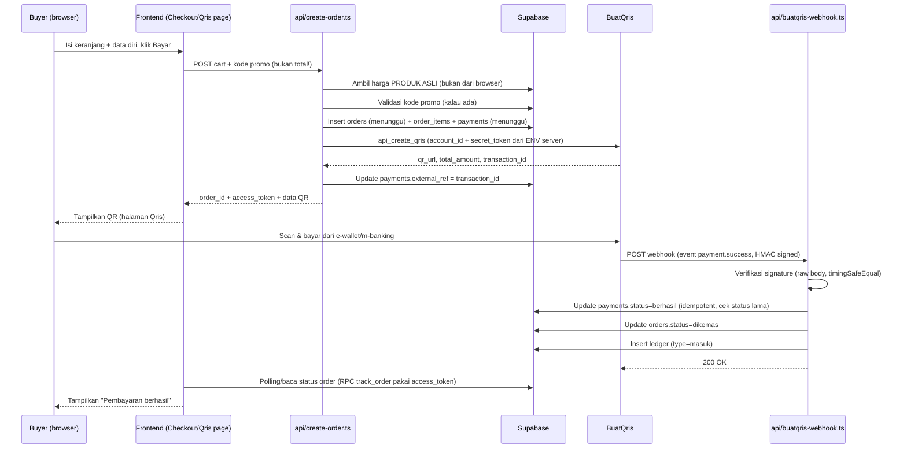
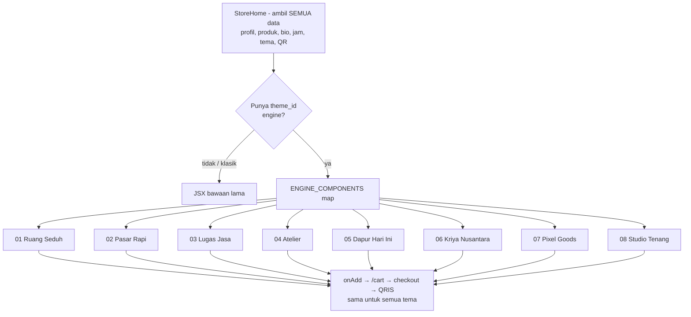

# ARCHITECTURE — TokoLink

Diagram di sini pakai sintaks **Mermaid** (bisa dirender GitHub/editor
Markdown, dan tetap terbaca sebagai teks terstruktur kalau tidak
dirender). Ini pelengkap `docs/PRD.md` (APA) dan `AGENTS.md` (ATURAN) —
dokumen ini fokus ke BAGAIMANA sistemnya saling terhubung.

---

## 1. Diagram Sistem (High-Level)



**Kenapa dua jalur ke Supabase (langsung dari SPA vs lewat API)?**
- SPA boleh query Supabase langsung untuk data yang aman dibatasi RLS
  (baca produk, baca punya sendiri, dst) — pakai `SUPABASE_ANON_KEY`.
- Apapun yang butuh **kredensial rahasia** (BuatQris) atau **hitung
  ulang harga di server supaya tidak bisa dimanipulasi buyer** (total
  checkout) HARUS lewat `api/*`, yang jalan di server pakai
  `SUPABASE_SERVICE_ROLE_KEY` + secret BuatQris. Tidak pernah sebaliknya.

---

## 2. ER Diagram (Skema Database)



Detail kolom lengkap + RLS policy → `database/schema.sql` dan file
migrasi bernomor di folder yang sama. **Diagram ini ringkasan, bukan
sumber kebenaran** — kalau ada beda antara diagram ini dan
`schema.sql`, **`schema.sql` yang benar**, laporkan selisihnya ke user.

---

## 3. Alur Checkout & Pembayaran (Sequence Diagram)



**Aturan yang WAJIB dipegang dari diagram ini** (jangan diubah tanpa
tanya user dulu):
1. Total yang dipakai untuk BuatQris SELALU dihitung ulang di server
   (`api/create-order.ts`) dari harga produk di database — tidak pernah
   percaya angka total yang dikirim browser.
2. Status pembayaran final HANYA berubah lewat webhook (`api/buatqris-
   webhook.ts`), tidak pernah lewat redirect URL di browser saja.
3. `access_token` (bukan `order_id` saja) yang jadi kunci buyer non-login
   melihat status pesanannya sendiri — lihat Memory Block `AGENTS.md`.

---

## 4. Struktur Folder

```
TokoLink/
├── README.md                    # profil repo (publik)
├── LICENSE                      # proprietary — Muhammad Farid
├── docs/
│   ├── PRD.md                     # APA yang dibangun & kenapa
│   ├── ARCHITECTURE.md            # file ini — BAGAIMANA sistem terhubung
│   ├── THEME_ENGINE.md            # laporan implementasi 8 tema
│   └── LOVABLE_BRIEF_THEME.md     # brief desain tema (arsip)
├── .opencode/
│   ├── AGENTS.md                  # aturan kerja agent (WAJIB dibaca duluan)
│   ├── TASKS.md                   # backlog kerja, urutan wajib
│   ├── opencode.json              # config model & permission
│   └── skill/                     # panduan teknis spesifik per topik
│       ├── supabase-rls-patterns/
│       ├── buatqris-webhook/
│       └── ui-interaction-patterns/
├── database/
│   ├── schema.sql                 # skema utama (SUMBER KEBENARAN kolom)
│   └── migrate_*.sql              # migrasi bertahap (fase3, fase5_theme,
│                                  # fase5_theme_id, storage, traffic, …)
├── api/                         # Vercel serverless functions (server-only)
│   ├── _lib.ts                    # helper bersama
│   ├── create-order.ts
│   ├── buatqris-webhook.ts
│   ├── admin-users.ts
│   └── delete-account.ts
├── src/
│   ├── components/                # UI reusable — JANGAN diubah strukturnya
│   ├── lib/
│   │   ├── router.tsx               # custom router, tetap dipakai
│   │   ├── supabase.ts              # client Supabase (anon key, aman di browser)
│   │   ├── auth.tsx                 # session + profil
│   │   ├── links.ts                 # detectLinkIcon() sentral (semua tema pakai ini)
│   │   ├── format.ts products.ts storage.ts cities.ts
│   │   └── data.tsx                 # DATA CONTOH lama — lihat AGENTS.md #9
│   ├── storefront/                # THEME ENGINE (hanya presentasi, tanpa query)
│   │   ├── types.ts                 # kontrak data tema ← halaman toko
│   │   ├── registry.ts              # daftar 8 tema + status tersedia
│   │   └── themes/                  # 1 file per tema + index.ts (peta ID→komponen)
│   └── pages/                     # satu file per grup halaman (lihat PRD.md §4)
└── public/                      # aset statis (logo, gambar, OG image)
```

---

## 5. Theme Engine (8 tema, satu data)



**Aturan yang WAJIB dipegang** (detail: `docs/THEME_ENGINE.md`):
1. Tema hanya menerima props (`src/storefront/types.ts`) — dilarang query Supabase/auth/cart langsung.
2. Tidak ada teks/harga/stok contoh di file tema; yang tidak ada datanya dibuang, bukan dikarang.
3. Bilah/CTA tema selalu mengarah ke `/cart` — tidak pernah mengalihkan order ke WhatsApp.
4. Pilihan seller tersimpan di `store_theme.theme_id` (`klasik` = bawaan); tambah tema baru = tambah file + 1 baris di peta, tanpa ubah alur beli.
